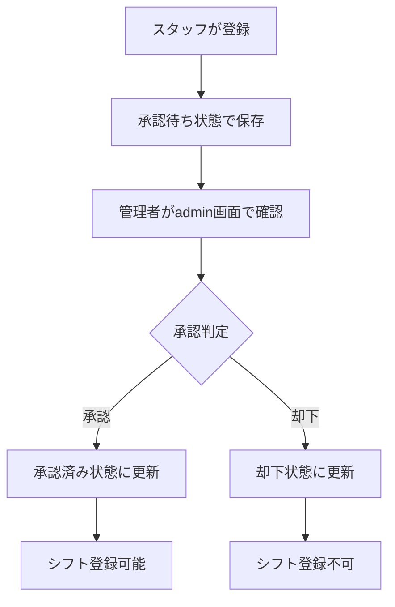
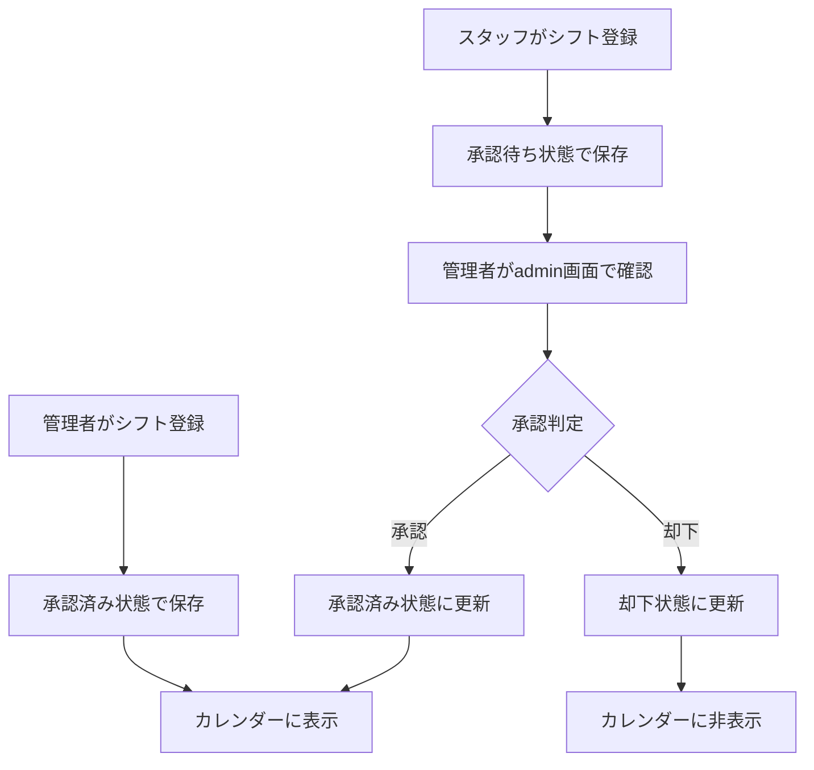

# わかくさシフト管理システム - システム概要

## 📋 システム概要

### 基本情報
- **システム名**: わかくさシフト管理システム
- **フレームワーク**: Django 5.2.3
- **言語**: Python 3.13.3
- **データベース**: SQLite3 (開発環境) / PostgreSQL (本番環境推奨)
- **フロントエンド**: Bootstrap 5 + FullCalendar.js
- **PDF生成**: WeasyPrint

### 主要機能
1. **スタッフ管理**
   - スタッフ登録・編集・削除
   - ユーザーアカウント連携
   - 承認フロー機能

2. **シフト管理**
   - シフト登録・編集・削除
   - カレンダー表示
   - 承認フロー機能
   - 一括登録機能

3. **承認システム**
   - スタッフ登録の承認
   - シフト登録の承認
   - 管理者による一括承認・却下

4. **レポート機能**
   - PDF出力
   - CSV出力
   - 時間チャート表示

## 🏗️ システム構成

### アプリケーション構成
```
wakakusa-shift-1/
├── core/                    # プロジェクト設定
│   ├── settings.py         # Django設定
│   ├── urls.py            # URLルーティング
│   └── wsgi.py            # WSGI設定
├── shift_management/        # メインアプリケーション
│   ├── models.py          # データモデル
│   ├── views.py           # ビューロジック
│   ├── forms.py           # フォーム定義
│   ├── admin.py           # 管理画面設定
│   └── urls.py            # アプリURL設定
├── templates/              # HTMLテンプレート
├── static/                 # 静的ファイル
├── requirements.txt        # 依存関係
└── manage.py              # Django管理コマンド
```

### データベース構成

#### 主要テーブル
1. **Staff (スタッフ)**
   - 基本情報: 名前、電話番号、メール、役職
   - 承認情報: 承認状態、承認者、承認日時
   - ユーザーアカウント連携

2. **Shift (シフト)**
   - シフト情報: スタッフ、日付、時間、シフト種別
   - 承認情報: 承認状態、承認者、承認日時
   - 作成者情報: 誰が作成したか

3. **ShiftType (シフト種別)**
   - 種別情報: 名前、色、デフォルト時間

4. **ShiftTemplate (シフトテンプレート)**
   - テンプレート管理: 定期的なシフトパターン

## 🔄 承認フロー

### スタッフ登録の承認フロー


### シフト登録の承認フロー


## 🌐 本番環境構成

### 推奨環境
- **OS**: Ubuntu 20.04 LTS以上
- **Webサーバー**: Nginx
- **アプリケーションサーバー**: Gunicorn
- **データベース**: PostgreSQL 12以上
- **Python**: 3.9以上
- **SSL**: Let's Encrypt

### 本番環境アーキテクチャ
```
[インターネット]
       ↓
   [Nginx (SSL終端)]
       ↓
   [Gunicorn (Django)]
       ↓
   [PostgreSQL]
```

### セキュリティ設定
1. **HTTPS強制**
   - SSL証明書による暗号化
   - HSTS設定

2. **認証・認可**
   - Django標準認証
   - CSRF保護
   - セッション管理

3. **データベースセキュリティ**
   - 専用ユーザー作成
   - 最小権限の原則

## 📊 パフォーマンス

### 想定負荷
- **同時接続ユーザー**: 50人以下
- **データ量**: スタッフ100人、月間シフト3000件程度
- **レスポンス時間**: 平均500ms以下

### 最適化ポイント
1. **データベース**
   - インデックス設定
   - クエリ最適化

2. **静的ファイル**
   - Nginx配信
   - ブラウザキャッシュ

3. **アプリケーション**
   - select_related使用
   - ページネーション

## 🔧 運用・保守

### 監視項目
1. **システム監視**
   - CPU使用率
   - メモリ使用率
   - ディスク使用率

2. **アプリケーション監視**
   - レスポンス時間
   - エラー率
   - ログ監視

3. **データベース監視**
   - 接続数
   - クエリ実行時間
   - ロック状況

### バックアップ戦略
1. **データベースバックアップ**
   - 日次フルバックアップ
   - 時間単位の差分バックアップ

2. **ファイルバックアップ**
   - アプリケーションファイル
   - 設定ファイル
   - ログファイル

### ログ管理
1. **アプリケーションログ**
   - Django標準ログ
   - エラーログ
   - アクセスログ

2. **システムログ**
   - Nginxアクセスログ
   - システムログ

## 🚀 デプロイメント

### デプロイフロー
1. **開発環境でテスト**
2. **Gitリポジトリにプッシュ**
3. **本番サーバーでプル**
4. **依存関係更新**
5. **マイグレーション実行**
6. **静的ファイル収集**
7. **サービス再起動**

### 設定ファイル
- `settings.py`: 環境別設定
- `gunicorn.conf.py`: Gunicorn設定
- `nginx.conf`: Nginx設定

## 🔍 トラブルシューティング

### よくある問題と対処法

#### 1. データベース接続エラー
```bash
# PostgreSQL接続確認
sudo -u postgres psql -c "SELECT version();"

# Django設定確認
python manage.py dbshell
```

#### 2. 静的ファイルが表示されない
```bash
# 静的ファイル収集
python manage.py collectstatic --noinput

# Nginx設定確認
sudo nginx -t
```

#### 3. メモリ不足
```bash
# メモリ使用量確認
free -h

# Gunicornワーカー数調整
# gunicorn.conf.py の workers 設定を変更
```

## 📈 スケーリング

### 垂直スケーリング
- CPU/メモリ増強
- SSD使用
- データベース最適化

### 水平スケーリング
- ロードバランサー導入
- データベースレプリケーション
- CDN利用

## 🔐 セキュリティチェックリスト

- [ ] HTTPS設定完了
- [ ] Django SECRET_KEY設定
- [ ] DEBUG = False設定
- [ ] データベースパスワード設定
- [ ] ファイアウォール設定
- [ ] 定期的なセキュリティアップデート
- [ ] バックアップ動作確認
- [ ] ログ監視設定

## 📞 サポート情報

### 緊急時連絡先
- システム管理者: [連絡先]
- 開発者: [連絡先]

### ドキュメント
- [PRODUCTION_SETUP_GUIDE.md](./PRODUCTION_SETUP_GUIDE.md): 本番環境セットアップ
- [LOCAL_SETUP.md](./LOCAL_SETUP.md): 開発環境セットアップ
- [FEATURES.md](./FEATURES.md): 機能一覧

---

**最終更新**: 2025年6月13日  
**バージョン**: 1.0.0 